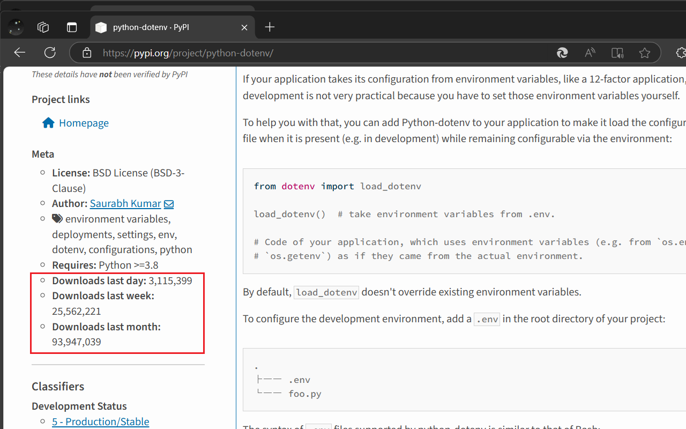

This is a [Microsoft Edge extension](https://microsoftedge.microsoft.com/addons/detail/pypi-downloads-stats/dncpkpafbfaechcdhfhgoebfdfccogij) to help you find downloads amount for python packages [checkout "meta" section under left sidebar], which is useful for python developer to identify if current package is popular or not.

It is rely on [pypistats.org](https://pypistats.org/), which querying Google Cloud BigQuery to get the data.

Due to CORS restriction, this extension can only query the data from a proxy which enable CORS, thus you may [build your own proxy server](https://github.com/ZXS66/pypistats-proxy) or use third party CORS proxy(such as [CorsProxy.io](https://corsproxy.io) or [crossorigin.me](https://corsproxy.github.io/)) if you want to use it , or you can use this extension for free (no ads) on Microsoft Edge (personal use only, be nice).
